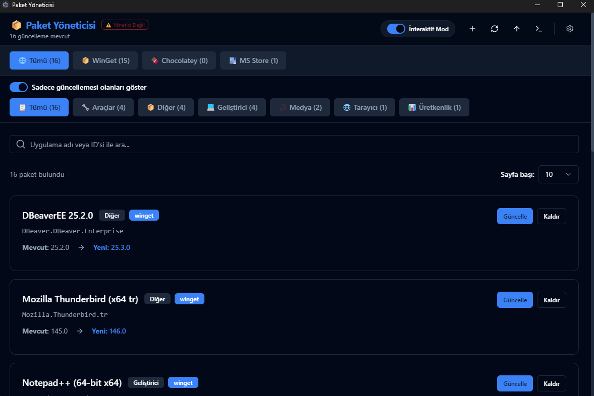

# 📦 Paket Yöneticisi (WinPackage UI)

Windows için modern, hızlı ve kullanıcı dostu bir paket yöneticisi arayüzü. **Winget** ve **Chocolatey** gibi popüler paket yöneticilerini tek bir çatı altında toplayarak, komut satırı ile uğraşmadan uygulamalarınızı yönetmenizi sağlar.



## ✨ Özellikler

*   **Çoklu Kaynak Desteği:** Winget ve Chocolatey paketlerini aynı anda arayın, listeleyin ve yönetin.
*   **Modern ve Hızlı Arayüz:** **Vue 3** ve **Tailwind CSS** ile geliştirilmiş, akıcı ve duyarlı kullanıcı deneyimi.
*   **Kolay Paket Yönetimi:**
    *   🚀 **Yeni Yükle:** Binlerce uygulama arasından arama yapın ve tek tıkla yükleyin.
    *   🔄 **Güncelle:** Tüm güncel olmayan paketleri listeleyin ve hepsini veya seçtiklerinizi güncelleyin.
    *   🗑️ **Kaldır:** İstemediğiniz uygulamaları kolayca sisteminizden kaldırın.
*   **İnteraktif Mod:** Kurulum sırasında terminal onayı gerektiren (lisans kabulü vb.) işlemler için entegre interaktif mod.
*   **Akıllı Filtreleme:**
    *   Kaynağa göre (Winget, Chocolatey, MS Store) filtreleme.
    *   Kategoriye göre filtreleme.
    *   Sadece güncellemesi olanları gösterme.
*   **Kişiselleştirme:**
    *   🌍 **Çoklu Dil:** Türkçe ve İngilizce dil desteği.
    *   🎨 **Tema:** Aydınlık (Light) ve Karanlık (Dark) mod seçenekleri.
*   **Konsol Takibi:** Arka planda çalışan komutların çıktılarını canlı olarak konsol penceresinden izleyebilme.

## 🛠️ Teknolojiler

Bu proje, modern web ve masaüstü teknolojilerinin gücünü birleştirir:

*   **[Tauri](https://tauri.app/):** Rust tabanlı, hafif ve güvenli masaüstü entegrasyonu.
*   **[Vue 3](https://vuejs.org/):** Reaktif ve modüler frontend mimarisi (Composition API).
*   **[TypeScript](https://www.typescriptlang.org/):** Tip güvenliği ve sağlam kod yapısı.
*   **[Pinia](https://pinia.vuejs.org/):** Merkezi durum (state) yönetimi.
*   **[Tailwind CSS](https://tailwindcss.com/):** Modern ve esnek stillendirme.
*   **[shadcn-vue](https://www.shadcn-vue.com/):** Erişilebilir ve profesyonel UI bileşenleri.
*   **[vue-i18n](https://kazupon.github.io/vue-i18n/):** Uluslararasılaştırma (i18n) altyapısı.

## 🚀 Kurulum ve Çalıştırma

Projeyi yerel ortamınızda çalıştırmak veya geliştirmek için aşağıdaki adımları izleyin.

### Gereksinimler
*   **Node.js** (v18 veya üzeri önerilir)
*   **Rust** (Tauri için gereklidir - [rustup.rs](https://rustup.rs/))
*   **Winget** (Windows 10/11 ile yüklü gelir)
*   **Chocolatey** (Opsiyonel, Choco paketlerini yönetmek için gereklidir)

### Kurulum Adımları

1.  **Repoyu Klonlayın:**
    ```bash
    git clone https://github.com/Fatih-Sglm/win-package-ui.git
    cd win-package-ui
    ```

2.  **Bağımlılıkları Yükleyin:**
    ```bash
    pnpm install
    ```

3.  **Geliştirme Modunda Başlatın:**
    Bu komut hem Vite sunucusunu hem de Tauri penceresini başlatır (Hot Reload aktiftir).
    ```bash
    pnpm run tauri dev
    ```

4.  **Uygulamayı Derleyin (Build):**
    Üretim (Production) için exe/installer oluşturmak isterseniz:
    ```bash
    pnpm run tauri build
    ```

## 📦 Release Oluşturma

Proje, GitHub Actions ile otomatik release sistemi kullanır. Her yeni versiyon tag'i oluşturulduğunda otomatik olarak Windows installer'ları (MSI ve EXE) build edilir.

### Yeni Release Adımları

1.  **Versiyon numarasını güncelleyin:**
    - `src-tauri/tauri.conf.json` → `"version": "0.2.0"`
    - `src-tauri/Cargo.toml` → `version = "0.2.0"`

2.  **Değişiklikleri commit edin:**
    ```bash
    git add .
    git commit -m "chore: bump version to 0.2.0"
    git push
    ```

3.  **Tag oluşturun ve push edin:**
    ```bash
    git tag v0.2.0
    git push origin v0.2.0
    ```

4.  **GitHub Actions otomatik olarak:**
    - Uygulamayı build eder
    - MSI ve EXE installer'ları oluşturur
    - GitHub Release sayfasına yükler

> **Not:** Release'ler [GitHub Releases](https://github.com/Fatih-Sglm/winget-ui/releases) sayfasından indirilebilir.

## ⚠️ Önemli Notlar

*   **Yönetici Yetkisi (Admin Rights):** Paket yükleme ve kaldırma işlemleri genellikle Windows'ta yönetici izni gerektirir. Uygulamanın tüm özelliklerini sorunsuz kullanabilmek için **Yönetici olarak çalıştırılması** tavsiye edilir. Uygulama, yönetici modunda çalışıp çalışmadığını arayüzde belirtir.
*   **İnteraktif Mod:** Bazı paketler yüklenirken kullanıcıdan "Y/N" onayı veya lisans kabulü bekleyebilir. Yükleme takılı kalırsa **İnteraktif Mod**'u açarak işlemi gerçekleştirebilirsiniz.

## 🤝 Katkıda Bulunma

Her türlü katkıya açığız! Hata bildirmek veya yeni özellik önermek için lütfen "Issues" kısmını kullanın. Pull Request göndermekten çekinmeyin.

1.  Repoyu Forklayın
2.  Yeni bir Branch oluşturun (`git checkout -b feature/YeniOzellik`)
3.  Değişikliklerinizi Commit'leyin (`git commit -m 'Yeni özellik eklendi'`)
4.  Branch'i Push'layın (`git push origin feature/YeniOzellik`)
5.  Bir Pull Request oluşturun

## 📝 Lisans

Bu proje [MIT](LICENSE) lisansı ile lisanslanmıştır.
